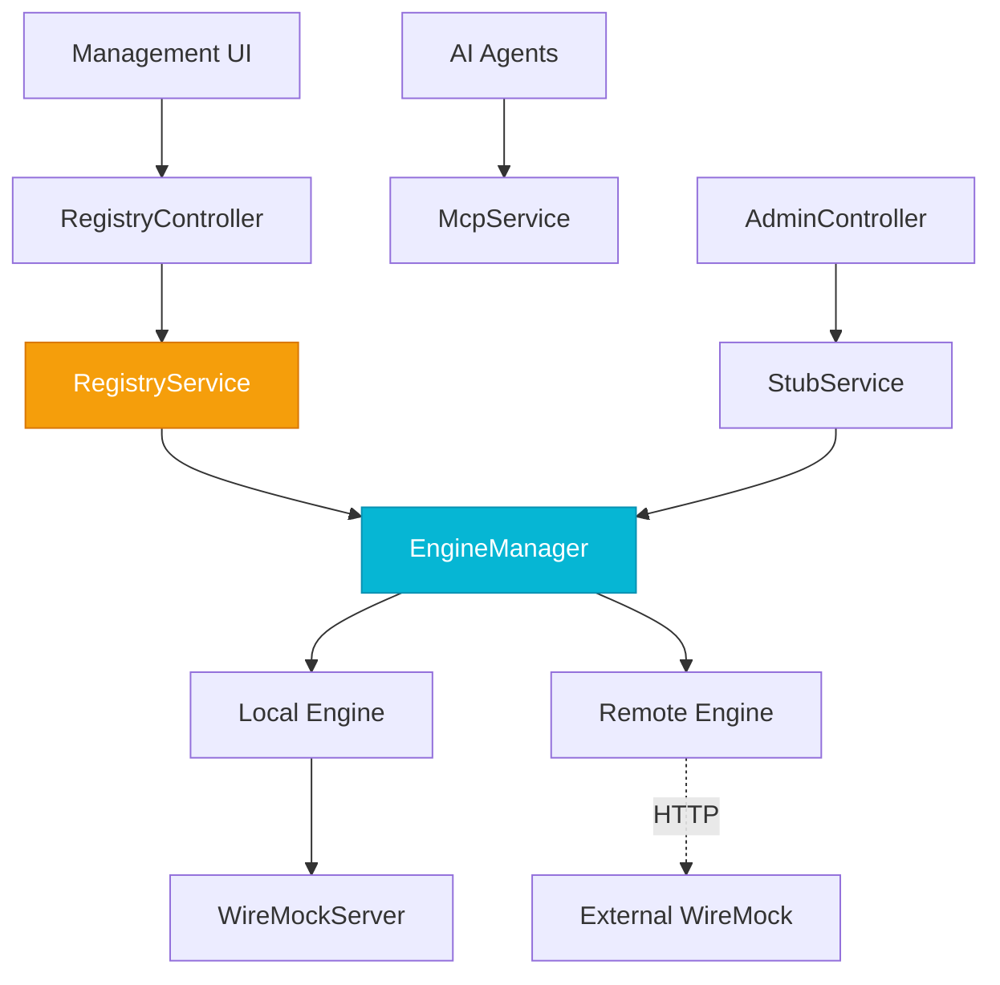

# Layers & Components

WIXY Hub is organised into five distinct layers, providing a clean separation between the management orchestrator and the traffic plane engines.

## Layer 1 — Embedded WireMock Engine

The foundation of the `LOCAL` engine. An embedded WireMock server handles HTTP stubbing, proxy forwarding, and traffic recording within the Hub process.

### `WireMockConfig`
Manages the lifecycle of the embedded server instance.

**Responsibilities:**
- Start/Stop the embedded `WireMockServer` bean.
- Apply startup configurations from `WixyProperties`.

## Layer 1.5 — Engine Abstraction

The Hub evolution introduced this layer to allow management of any WireMock instance, regardless of its location.

### `WireMockEngine` (Interface)
The standard interface for all Hub operations. It decouples the management services from the underlying server implementation.

### `LocalWireMockEngine`
Implementation that interacts with the in-process `WireMockServer`. Used for the "Embedded" engine.

### `RemoteWireMockEngine`
Implementation that communicates with an external server via the WireMock REST Admin API. Used for "Remote" fleet management.

### `EngineManager`
The central engine orchestrator. It manages the lifecycle of engine instances and handles **Contextual Routing**—determining whether a command should go to the local server or a remote one based on the current user session or per-request headers.

## Layer 2 — Fleet Registry

### `ServerRegistryService`
Responsible for the persistence and health of the server fleet.
- **Persistence**: Saves and loads managed servers from `~/.wixy/servers.json`.
- **Health Monitoring**: Periodically validates reachability of remote engines.
- **Bootstrapping**: Automatically registers the local instance on first launch.

### `WixyProperties`
Centralized Spring `@ConfigurationProperties` bean that handlesHub settings, registry paths, and security keys.

## Layer 3 — Service Layer

Business logic that mediates between external interfaces and the internal orchestration engine.

### `StubService`, `ProxyService`, `RecordingService`
These services are now **Engine-Agnostic**. They fetch the current **Active Engine** from the `EngineManager` for every operation, allowing them to support both local and remote scenarios without code duplication.

## Layer 4 — REST & AI Interfaces

### `AdminController`
Full CRUD for stub management on the active engine.

### `RegistryController`
REST API for managing the server fleet and context switching.

### `WixyMcpService`
Exposes the Hub's capabilities as **AI Tools** via the Model Context Protocol.

## Dependency Graph

