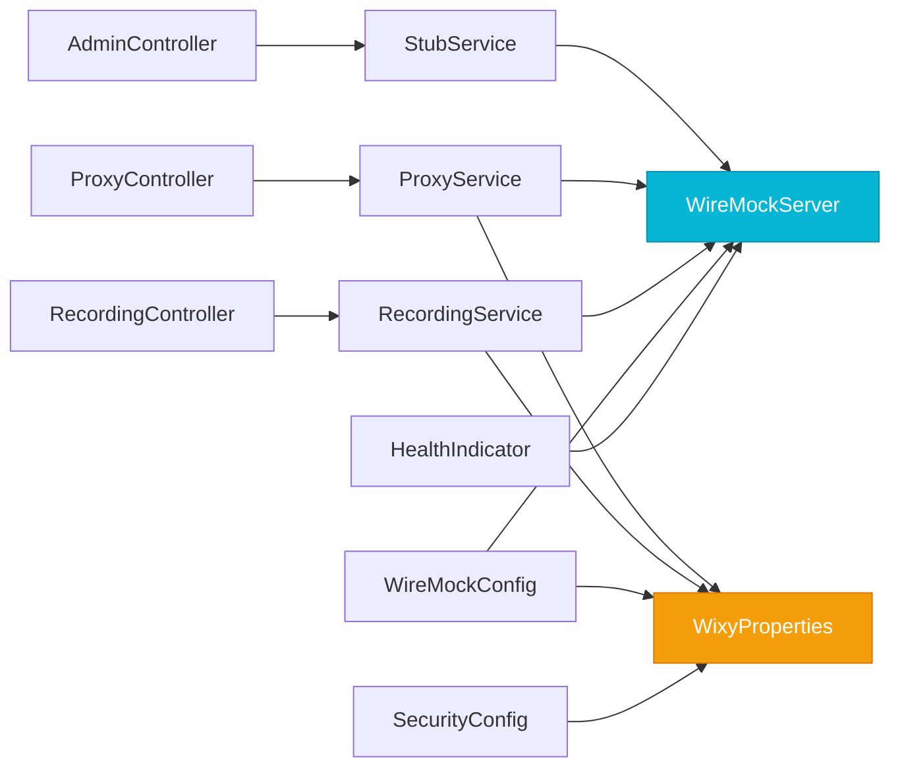

# Layers & Components

WIXY is organised into four distinct layers, each with clear responsibilities. This page details every component and its role in the system.

## Layer 1 — Embedded WireMock Engine

The foundation of WIXY. An embedded WireMock server handles all HTTP stubbing, proxy forwarding, and traffic recording.

### `WireMockConfig`

Manages the complete lifecycle of the embedded WireMock server:

```java
@Configuration
public class WireMockConfig {
    @PostConstruct
    public void start() {
        // Creates WireMockServer with options from WixyProperties
        // Configures proxy/recording if enabled
        // Starts the server
    }

    @PreDestroy
    public void stop() {
        // Graceful shutdown of WireMock server
    }
}
```

**Responsibilities:**
- Create `WireMockServer` with options derived from `WixyProperties`
- Start server on Spring context startup (`@PostConstruct`)
- Stop server on Spring context shutdown (`@PreDestroy`)
- Configure proxy forwarding when `wixy.proxy.enabled=true`
- Auto-start recording when `wixy.proxy.record=true`
- Register catch-all proxy mapping for proxy-only mode (no recording)

### `WireMockHealthIndicator`

Custom Spring Boot Actuator health indicator:

```java
@Component("wiremock")
public class WireMockHealthIndicator implements HealthIndicator {
    @Override
    public Health health() {
        // Reports: UP/DOWN, port number, active stub count
    }
}
```

**Health Response Example:**

```json
{
  "status": "UP",
  "components": {
    "wiremock": {
      "status": "UP",
      "details": {
        "port": 9090,
        "stubCount": 3
      }
    }
  }
}
```

## Layer 2 — Configuration

Type-safe, externalised configuration using Spring Boot's `@ConfigurationProperties`.

### `WixyProperties`

Bound from the `wixy.*` namespace in `application.yml`:

```java
@ConfigurationProperties(prefix = "wixy")
@Validated
public class WixyProperties {
    private Wiremock wiremock;   // port, verbose, rootDir
    private Proxy proxy;         // enabled, targetUrl, record
    private Security security;   // enabled, apiKey
}
```

| Property | Type | Default | Description |
|----------|------|---------|-------------|
| `wixy.wiremock.port` | `int` | `9090` | WireMock server port (0–65535) |
| `wixy.wiremock.verbose` | `boolean` | `true` | Enable verbose WireMock logging |
| `wixy.wiremock.root-dir` | `String` | `classpath:/wiremock` | Root directory for stub mappings |
| `wixy.proxy.enabled` | `boolean` | `false` | Enable proxy mode |
| `wixy.proxy.target-url` | `String` | `""` | Upstream URL for proxy/recording |
| `wixy.proxy.record` | `boolean` | `false` | Enable traffic recording |
| `wixy.security.enabled` | `boolean` | `false` | Enable API-key authentication |
| `wixy.security.api-key` | `String` | `""` | Required API-key value |

### `SecurityConfig`

Optional API-key security filter, activated only when `wixy.security.enabled=true`:

```java
@Configuration
public class SecurityConfig {
    @Bean
    @ConditionalOnProperty(name = "wixy.security.enabled", havingValue = "true")
    public ApiKeyFilter apiKeyFilter(WixyProperties properties) { ... }
}
```

**Behaviour:**
- Checks `X-Wixy-Api-Key` header on every request
- Allows `/actuator/health`, `/actuator/info`, `/swagger-ui.html`, `/v3/api-docs` without authentication
- Returns `401 Unauthorized` for missing or invalid keys

## Layer 3 — Service Layer

Business logic that mediates between REST controllers and the WireMock server.

### `StubService`

Wraps WireMock's stub management operations:

| Method | Description |
|--------|-------------|
| `listAll()` | Returns all active stub mappings |
| `getById(UUID id)` | Returns a single stub or throws `StubNotFoundException` |
| `create(String json)` | Parses JSON, creates stub, returns `StubMapping` |
| `update(UUID id, String json)` | Updates existing stub or throws exceptions |
| `delete(UUID id)` | Removes stub mapping by UUID |
| `resetAll()` | Removes all active stub mappings |
| `importStubs(String json)` | Bulk-imports stubs from WireMock JSON format |

### `ProxyService`

Runtime proxy configuration management:

| Method | Description |
|--------|-------------|
| `getStatus()` | Returns current proxy state (enabled, targetUrl, port) |
| `enableProxy(String targetUrl)` | Adds catch-all proxy mapping at lowest priority |
| `disableProxy()` | Resets to default file-based mappings only |

### `RecordingService`

WireMock recording lifecycle:

| Method | Description |
|--------|-------------|
| `startRecording(String targetUrl)` | Starts recording to target URL |
| `stopRecording()` | Stops recording, returns captured stubs |
| `getStatus()` | Returns current recording state |

## Layer 4 — REST Controllers

Spring MVC controllers exposing the Admin API over HTTP.

### `AdminController` — `/wixy/admin/mappings`

Full CRUD for stub management:

| Method | Path | Status | Description |
|--------|------|--------|-------------|
| `GET` | `/wixy/admin/mappings` | 200 | List all stubs |
| `POST` | `/wixy/admin/mappings` | 201 | Create new stub |
| `GET` | `/wixy/admin/mappings/{id}` | 200 | Get stub by UUID |
| `PUT` | `/wixy/admin/mappings/{id}` | 200 | Update stub |
| `DELETE` | `/wixy/admin/mappings/{id}` | 204 | Delete stub |
| `POST` | `/wixy/admin/mappings/reset` | 200 | Reset all stubs |
| `POST` | `/wixy/admin/mappings/import` | 200 | Bulk import |

### `ProxyController` — `/wixy/admin/proxy`

| Method | Path | Status | Description |
|--------|------|--------|-------------|
| `GET` | `/wixy/admin/proxy` | 200 | Get proxy status |
| `POST` | `/wixy/admin/proxy/enable` | 200 | Enable proxy to target URL |
| `POST` | `/wixy/admin/proxy/disable` | 200 | Disable proxy |

### `RecordingController` — `/wixy/admin/recordings`

| Method | Path | Status | Description |
|--------|------|--------|-------------|
| `POST` | `/wixy/admin/recordings/start` | 200 | Start recording |
| `POST` | `/wixy/admin/recordings/stop` | 200 | Stop recording |
| `GET` | `/wixy/admin/recordings/status` | 200 | Get recording state |

## Exception Handling

The `GlobalExceptionHandler` maps domain exceptions to HTTP responses:

| Exception | HTTP Status | Description |
|-----------|-------------|-------------|
| `StubNotFoundException` | 404 | Requested stub UUID does not exist |
| `InvalidStubDefinitionException` | 400 | Malformed stub JSON |
| `WixyException` | 500 | Generic domain error |
| `Exception` | 500 | Unexpected errors |

**Error Response Format:**

```json
{
  "timestamp": "2025-01-15T10:30:00Z",
  "status": 404,
  "error": "Not Found",
  "message": "Stub mapping not found: a1b2c3d4-..."
}
```

## Dependency Graph


