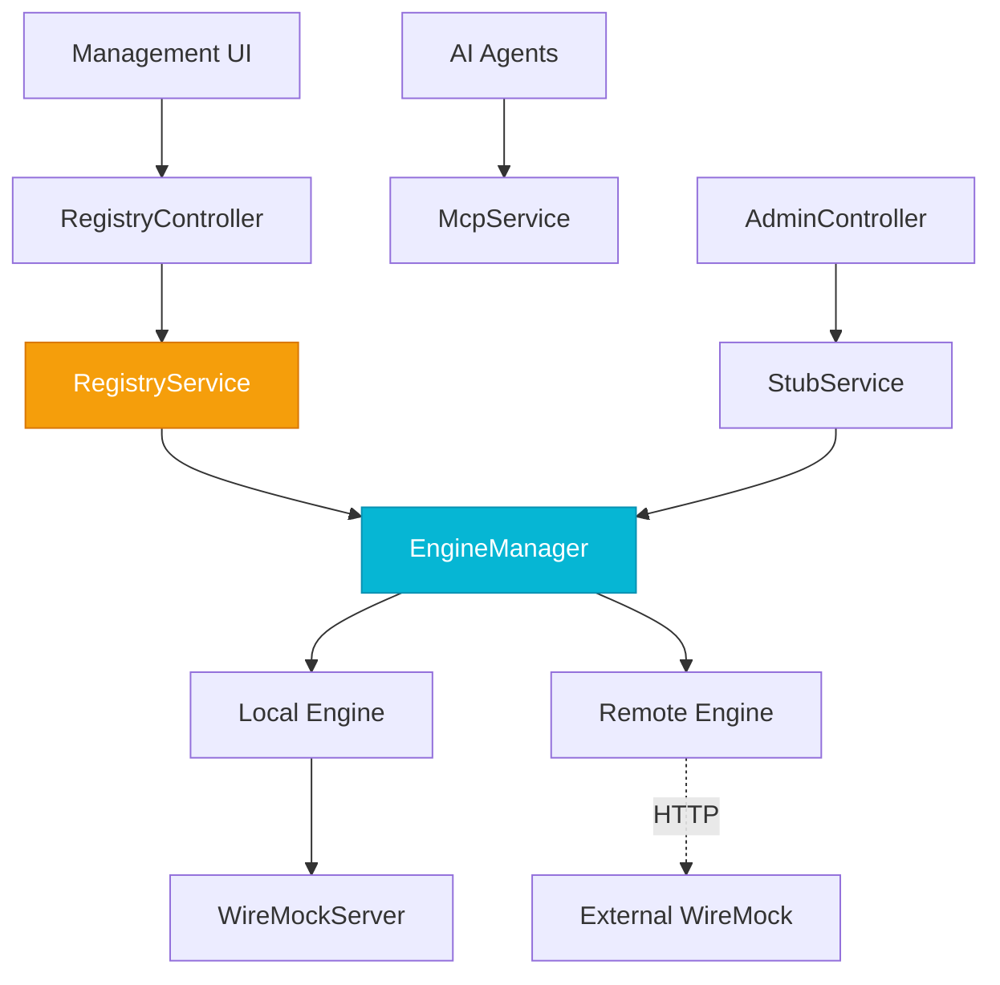

# Layers & Components

WIXY Hub is organised into five distinct layers, providing a clean separation between the management orchestrator and the traffic plane engines.

## Layer 1 — Embedded WireMock Engine

The foundation of the `LOCAL` engine. An embedded WireMock server handles HTTP stubbing, proxy forwarding, and traffic recording within the Hub process.

### `WireMockConfig`
Manages the lifecycle of the embedded server instance.

**Responsibilities:**
- Start/Stop the embedded `WireMockServer` bean.
- Apply startup configurations from `WixyProperties`.

## Layer 1.5 — Engine Abstraction

The Hub evolution introduced this layer to allow management of any WireMock instance, regardless of its location.

### `WireMockEngine` (Interface)
The standard interface for all Hub operations. Defines methods for stub CRUD, proxying, and recording.

### `LocalWireMockEngine`
Implementation that interacts with the in-process `WireMockServer`.

### `RemoteWireMockEngine`
Implementation that communicates with an external server via the WireMock REST Admin API.

### `EngineManager`
The central engine orchestrator.
- Maintains the **Active Engine** (global context).
- Manages **Request Overrides** via `ThreadLocal` for direct targeting.

## Layer 2 — Configuration & Registry

### `ServerRegistryService`
Manages the persistent list of managed servers.
- Handles CRUD for the server fleet.
- Persists registry data to `servers.json`.
- Facilitates context switching between engines.

### `WixyProperties`
Externalised configuration for the Hub, Registry, and UI.

## Layer 3 — Service Layer

Business logic that mediates between interfaces and the `EngineManager`.

### `StubService`, `ProxyService`, `RecordingService`
These services no longer depend on a specific server instance. Instead, they fetch the **current active engine** from the `EngineManager` for every operation.

## Layer 4 — REST & AI Interfaces

### `AdminController`
Full CRUD for stub management on the active engine.

### `RegistryController`
REST API for managing the server fleet and context switching.

### `WixyMcpService`
Exposes the Hub's capabilities as **AI Tools** via the Model Context Protocol.

## Dependency Graph

