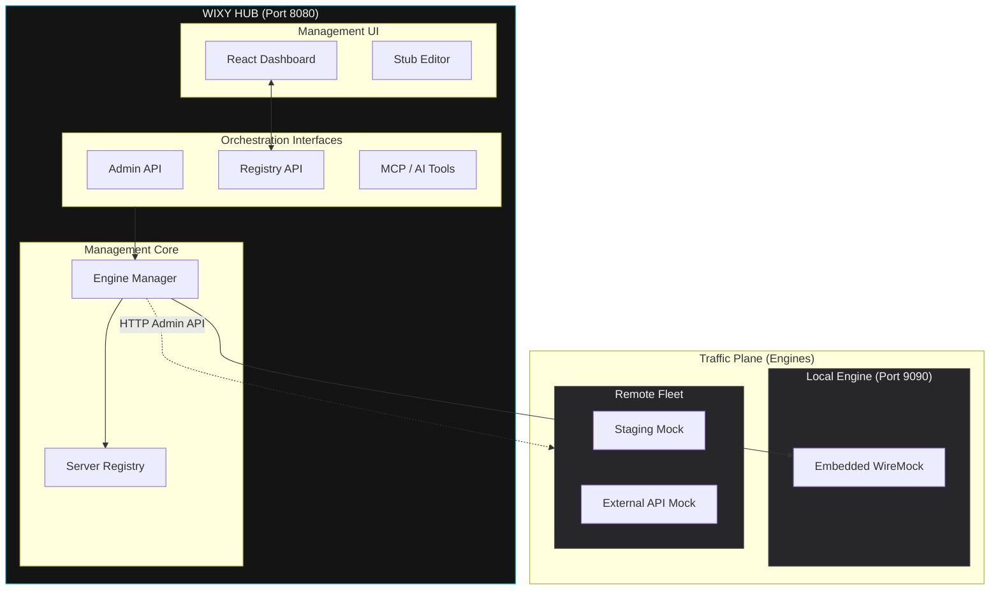

# Architecture Overview

WIXY Hub is a **Management-as-an-Orchestrator** platform. It decouples the administrative plane (Spring Boot Hub) from the traffic plane (WireMock Engines), allowing for the centralized management of complex test environments from a single dashboard.

## Orchestration Logic

The Hub acts as a **smart proxy** for management commands. When you create a stub or enable recording, the Hub determines which engine should receive the command based on the global **Active Engine** context or per-request headers.

## Core Capabilities

### 1. Centralized Stub Management
The Hub provides a unified REST API and Web UI to manage stubs across your entire fleet. You can create, update, and delete mappings on any registered server without manually switching URLs or ports.

### 2. Fleet Registry
A persistent registry stored at `~/.wixy/servers.json` tracks all your managed instances. The Hub automatically includes the local embedded server on first boot, providing a zero-config experience.

### 3. Transparent Direct Targeting
By using the `X-Wixy-Target-Server` header, CI/CD pipelines and automated tests can route commands to specific remote engines atomically, bypassing the global "Active Engine" context for high-concurrency orchestration.

### 4. Per-Engine Proxying
Each registered engine (local or remote) can have its own independent **Target Upstream URL**. This allows you to orchestrate a multi-service mock environment where different engines proxy to different backend microservices simultaneously.
