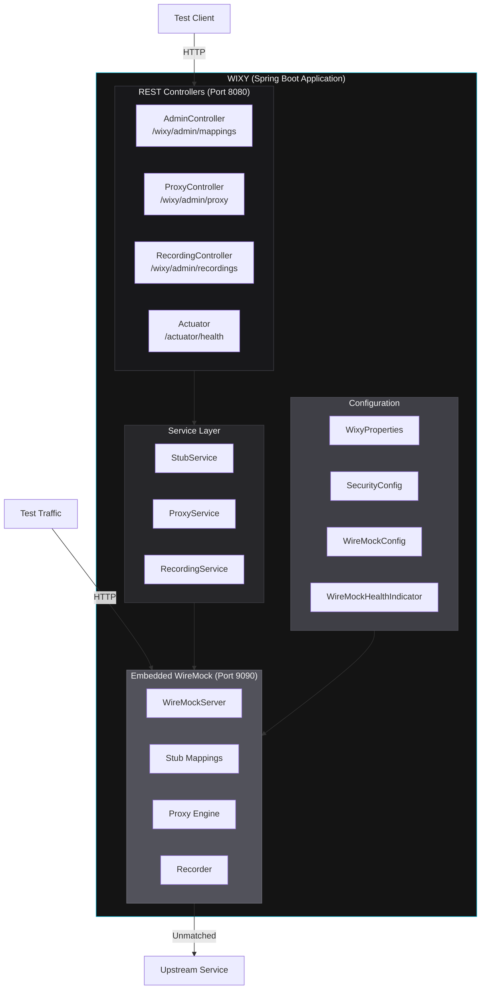
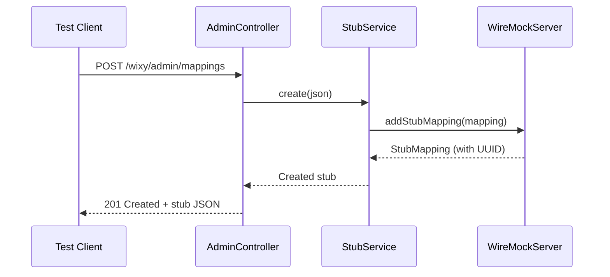
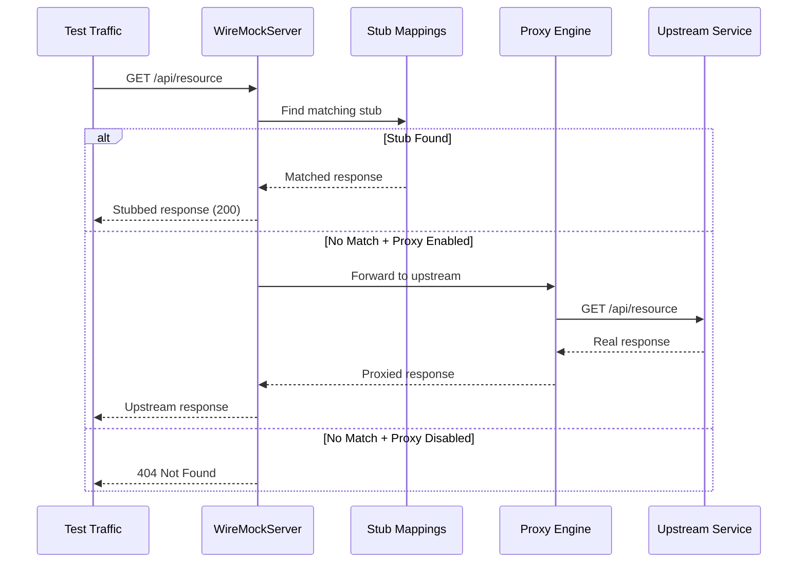

# Architecture Overview

WIXY follows a **layered architecture** with clear separation of concerns. A Spring Boot application manages the lifecycle of an embedded WireMock server, exposing administrative controls through REST endpoints while WireMock handles the actual request stubbing and proxying.

## High-Level Architecture



## Key Design Decisions

| # | Decision | Rationale |
|---|----------|-----------|
| D1 | **Two ports**: Spring Boot on `8080`, WireMock on `9090` | Clear separation of management and traffic planes. Ports are independently configurable. |
| D2 | WireMock managed via a **Spring `@Bean`** with `@PostConstruct`/`@PreDestroy` | Lifecycle is tied to the Spring context — guarantees clean startup and graceful shutdown. |
| D3 | **Proxy/record mode** is opt-in via config | When `wixy.proxy.target-url` is set, unmatched requests proxy upstream. When empty, unmatched requests return 404. |
| D4 | Stubs from **classpath AND runtime API** | Pre-packaged stubs in `classpath:/wiremock/mappings/` load on startup; dynamic stubs created via Admin API at runtime. |
| D5 | **No authentication by default** | Test tools should be frictionless locally but lockable in shared environments via optional API-key. |
| D6 | **Configuration externalised** via profiles + env vars | 12-factor compliant. Easy to configure in any runtime (local, Docker, K8s, cloud). |

## Component Interaction Flow

### Stub Creation Flow



### Request Matching Flow



## Package Structure

```
io.github.vinipx.wixy/
├── WixyApplication.java              # Spring Boot entry point
├── config/
│   ├── WireMockConfig.java            # WireMock bean + lifecycle
│   ├── WixyProperties.java            # @ConfigurationProperties
│   ├── SecurityConfig.java            # Optional API-key filter
│   └── WireMockHealthIndicator.java   # Custom health indicator
├── controller/
│   ├── AdminController.java           # Stub CRUD REST API
│   ├── ProxyController.java           # Proxy config toggles
│   └── RecordingController.java       # Record/stop/status
├── service/
│   ├── StubService.java               # Stub business logic
│   ├── ProxyService.java              # Proxy management logic
│   └── RecordingService.java          # Recording lifecycle
└── exception/
    ├── WixyException.java             # Base exception
    ├── StubNotFoundException.java     # 404 for missing stubs
    ├── InvalidStubDefinitionException.java  # 400 for bad JSON
    └── GlobalExceptionHandler.java    # @ControllerAdvice
```

## Resource Structure

```
src/main/resources/
├── application.yml              # Default configuration
├── application-local.yml        # Local dev overrides
├── application-docker.yml       # Docker overrides
├── application-cloud.yml        # Cloud overrides (security ON)
└── wiremock/
    ├── mappings/                 # Pre-packaged stub JSON files
    │   └── sample-stub.json
    └── __files/                  # Response body files
        └── sample-response.json
```

## Thread Model

WIXY runs two independent server threads:

1. **Spring Boot (Tomcat)** — Handles Admin API requests on port `8080`
2. **WireMock (Jetty)** — Handles stub/proxy traffic on port `9090`

Both servers share the same JVM process, enabling direct in-process communication between the Spring service layer and WireMock's internal APIs without network overhead.

:::info
For detailed component specifications including every class and method, see the [Layers documentation](/docs/architecture/layers).
:::
