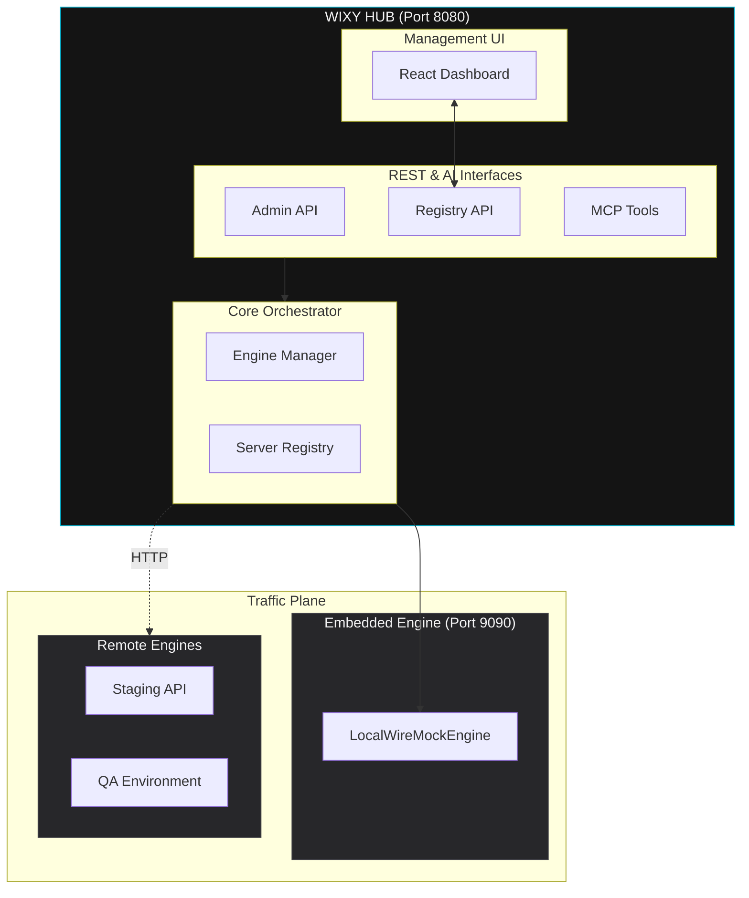

# Architecture Overview

WIXY Hub follows a **Management-as-an-Orchestrator** architecture. It decouples the administrative plane (Spring Boot Hub) from the traffic plane (WireMock Engines), allowing for the management of multiple environments from a single point of control.

## High-Level Architecture

## Key Design Decisions

| # | Decision | Rationale |
|---|----------|-----------|
| **D1** | **Multi-Engine Abstraction** | The Hub uses a `WireMockEngine` interface, making it transparent whether you are managing a local instance or a remote one. |
| **D2** | **Contextual State** | The Hub maintains an "Active Engine" state, allowing UI and AI agents to work within a focused environment. |
| **D3** | **Per-Request Routing** | The `X-Wixy-Target-Server` header allows for atomic orchestration—routing single commands to specific servers without context switching. |
| **D4** | **Persistent Registry** | Managed servers are stored in a local JSON file, ensuring the Hub infrastructure is portable and survives restarts. |
| **D5** | **Zero-Config Defaults** | On first launch, the Hub automatically registers and connects to its own embedded engine at port 9090. |

## The Engine Layer

WIXY Hub abstracts the WireMock API into two primary implementations:

### 1. Local Engine
Directly interacts with the `WireMockServer` instance running in the Hub's JVM. This provides the highest performance and zero network overhead for local development.

### 2. Remote Engine
Communicates with external WireMock instances via their REST Admin API. This allows the Hub to scale management across cloud environments and distributed teams.

:::info
For a detailed breakdown of the internal classes and service interactions, see the [Layers documentation](/docs/architecture/layers).
:::
