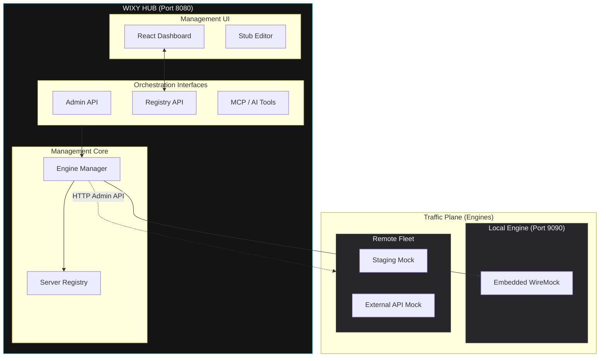

# Architecture Overview

WIXY Hub is a **Management-as-an-Orchestrator** platform. It decouples the administrative plane (Spring Boot Hub) from the traffic plane (WireMock Engines), allowing for the centralized management of complex test environments from a single dashboard.

## Orchestration Logic

The Hub acts as a **smart proxy** for management commands. When you create a stub or enable recording, the Hub determines which engine should receive the command based on the global **Active Engine** context or per-request headers.

## Management vs. Traffic Planes

WIXY Hub operates on two distinct logical planes:

1.  **Management Plane (Hub):** The Spring Boot application (Port 8080) that hosts the UI, manages the Fleet Registry, and orchestrates commands.
2.  **Traffic Plane (Engines):** One or more WireMock instances (Local Port 9090 or Remote) that handle the actual mock traffic from your applications.

This separation allows the Hub to remain a lightweight, stateless control center while the Traffic Plane handles heavy data loads.

## Unified Log Streaming

The Hub implements a **dual-mode logging architecture** to provide a single view of traffic regardless of where an engine is running:

*   **Local Streaming:** Uses direct memory interception via WireMock listeners to push logs to the UI via WebSockets.
*   **Remote Polling:** The Hub intelligently polls the Admin API of remote engines and multiplexes that data into the same WebSocket stream, ensuring consistent visibility across the entire fleet.

## Core Capabilities

### 1. Unified Dashboard
The Dashboard provides a single pane of glass to configure any engine in the registry. By selecting an engine in the **Managed Engine** dropdown, the Hub automatically re-contexts all management commands (stubs, proxying, recording) to that specific instance.

### 2. Fleet Registry
A persistent registry tracks all managed instances. The Hub automatically includes the local embedded server on first boot, providing a zero-config experience.

### 3. Live TUI Console
A high-performance terminal interface (xterm.js) provides real-time traffic visibility with ANSI coloring, background persistence, and history search.
