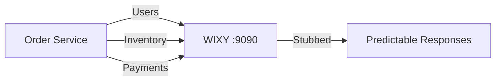

# Use Cases & Examples

Real-world scenarios and practical examples showing how to use WIXY in enterprise environments.

## Use Case 1: Microservice Integration Testing

**Scenario:** Your order service depends on a user service, inventory service, and payment service. You want to test the order service in isolation.



### Setup Stubs

```bash
# User service — authenticated user
curl -X POST http://localhost:8080/wixy/admin/mappings \
  -H "Content-Type: application/json" \
  -d '{
    "request": {"method": "GET", "urlPath": "/users/current"},
    "response": {
      "status": 200,
      "jsonBody": {"id": 42, "name": "Test User", "tier": "premium"}
    }
  }'

# Inventory service — product in stock
curl -X POST http://localhost:8080/wixy/admin/mappings \
  -H "Content-Type: application/json" \
  -d '{
    "request": {"method": "GET", "urlPath": "/inventory/SKU-001"},
    "response": {
      "status": 200,
      "jsonBody": {"sku": "SKU-001", "available": 150, "reserved": 12}
    }
  }'

# Payment service — successful charge
curl -X POST http://localhost:8080/wixy/admin/mappings \
  -H "Content-Type: application/json" \
  -d '{
    "request": {"method": "POST", "urlPath": "/payments/charge"},
    "response": {
      "status": 200,
      "jsonBody": {"transactionId": "TXN-789", "status": "APPROVED"}
    }
  }'
```

### Configure Order Service

```yaml title="order-service application-test.yml"
services:
  user-service:
    base-url: http://localhost:9090
  inventory-service:
    base-url: http://localhost:9090
  payment-service:
    base-url: http://localhost:9090
```

---

## Use Case 2: Contract Testing with Record & Playback

**Scenario:** Capture real API responses from a staging environment, then replay them in CI where the staging environment isn't accessible.

### Step 1: Record Against Staging

```bash
# Start recording
curl -X POST http://localhost:8080/wixy/admin/recordings/start \
  -d '{"targetUrl": "https://staging-api.example.com"}'

# Exercise all critical flows
curl http://localhost:9090/api/v2/users
curl http://localhost:9090/api/v2/products?category=electronics
curl -X POST http://localhost:9090/api/v2/orders \
  -d '{"productId": "P-001", "quantity": 2}'

# Stop recording
curl -X POST http://localhost:8080/wixy/admin/recordings/stop
```

### Step 2: Export Recorded Stubs

```bash
curl http://localhost:8080/wixy/admin/mappings > stubs/recorded-stubs.json
```

### Step 3: Replay in CI

```bash
# Start WIXY with pre-loaded stubs
# Place recorded stubs in wiremock/mappings/
./scripts/start-local.sh

# All recorded endpoints now return captured responses
curl http://localhost:9090/api/v2/users  # → recorded response
```

---

## Use Case 3: Fault Injection & Resilience Testing

**Scenario:** Test how your application handles various failure modes.

### Timeout Simulation

```bash
curl -X POST http://localhost:8080/wixy/admin/mappings \
  -H "Content-Type: application/json" \
  -d '{
    "request": {"method": "GET", "urlPath": "/api/slow-dependency"},
    "response": {
      "status": 200,
      "jsonBody": {"data": "eventual response"},
      "fixedDelayMilliseconds": 30000
    }
  }'
```

### Service Unavailable

```bash
curl -X POST http://localhost:8080/wixy/admin/mappings \
  -H "Content-Type: application/json" \
  -d '{
    "request": {"method": "GET", "urlPathPattern": "/api/unstable/.*"},
    "response": {
      "status": 503,
      "jsonBody": {"error": "Service Unavailable", "retryAfter": 30}
    }
  }'
```

### Rate Limiting

```bash
curl -X POST http://localhost:8080/wixy/admin/mappings \
  -H "Content-Type: application/json" \
  -d '{
    "request": {"method": "GET", "urlPath": "/api/rate-limited"},
    "response": {
      "status": 429,
      "headers": {"Retry-After": "60"},
      "jsonBody": {"error": "Too Many Requests"}
    }
  }'
```

### Bad Gateway

```bash
curl -X POST http://localhost:8080/wixy/admin/mappings \
  -H "Content-Type: application/json" \
  -d '{
    "request": {"method": "GET", "urlPath": "/api/gateway-error"},
    "response": {"status": 502, "body": "Bad Gateway"}
  }'
```

---

## Use Case 4: Partial Proxy (Selective Stubbing)

**Scenario:** Proxy most requests to a real backend, but stub specific endpoints that are under development.

```bash
# Enable proxy to real backend
curl -X POST http://localhost:8080/wixy/admin/proxy/enable \
  -d '{"targetUrl": "https://api.production.com"}'

# Stub the new endpoint that doesn't exist yet
curl -X POST http://localhost:8080/wixy/admin/mappings \
  -H "Content-Type: application/json" \
  -d '{
    "request": {"method": "GET", "urlPath": "/api/v3/recommendations"},
    "response": {
      "status": 200,
      "jsonBody": {
        "recommendations": [
          {"id": "R1", "title": "Suggested Product", "score": 0.95}
        ]
      }
    }
  }'

# Now:
# GET /api/v3/recommendations → stubbed response
# GET /api/v2/products         → proxied to production
# POST /api/v2/orders          → proxied to production
```

---

## Use Case 5: CI/CD Pipeline Integration

**Scenario:** Use WIXY as part of your automated test pipeline.

```yaml title=".github/workflows/test.yml"
jobs:
  integration-test:
    runs-on: ubuntu-latest
    services:
      wixy:
        image: wixy:latest
        ports:
          - 8080:8080
          - 9090:9090
        env:
          SPRING_PROFILES_ACTIVE: docker

    steps:
      - uses: actions/checkout@v4

      - name: Wait for WIXY
        run: |
          for i in {1..30}; do
            curl -sf http://localhost:8080/actuator/health && break
            sleep 2
          done

      - name: Load test stubs
        run: |
          for stub in test/stubs/*.json; do
            curl -X POST http://localhost:8080/wixy/admin/mappings \
              -H "Content-Type: application/json" \
              -d @"$stub"
          done

      - name: Run integration tests
        run: ./gradlew integrationTest
```

---

## Use Case 6: Multi-Team Shared Mock Server

**Scenario:** Multiple teams need a shared mock server in a development environment with API-key security.

```bash
# Deploy with security enabled
docker run -d \
  --name shared-wixy \
  -p 8080:8080 \
  -p 9090:9090 \
  -e SPRING_PROFILES_ACTIVE=cloud \
  -e WIXY_SECURITY_ENABLED=true \
  -e WIXY_SECURITY_API_KEY=team-shared-key-2025 \
  wixy:latest

# Teams create stubs with the API key
curl -X POST http://shared-wixy:8080/wixy/admin/mappings \
  -H "Content-Type: application/json" \
  -H "X-Wixy-Api-Key: team-shared-key-2025" \
  -d '{"request": {...}, "response": {...}}'
```
