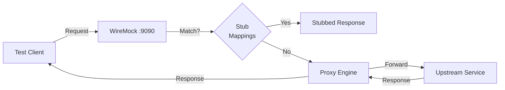

# Proxy Mode

WIXY can act as a transparent HTTP proxy, forwarding unmatched requests to an upstream service. This is ideal for scenarios where you want to stub some endpoints while letting others pass through to a real backend.

## How Proxy Mode Works



When proxy mode is enabled:

1. WireMock receives the request on port `9090`
2. It checks all active stub mappings for a match
3. If a match is found → returns the stubbed response
4. If no match → forwards the request to the configured upstream URL
5. The upstream's real response is returned to the client

The proxy mapping is registered at the **lowest priority** (`Integer.MAX_VALUE`), ensuring it only activates when no other stub matches.

## Enabling Proxy Mode

### Via Configuration (Startup)

```yaml title="application.yml"
wixy:
  proxy:
    enabled: true
    target-url: "https://api.example.com"
```

### Via Environment Variables

```bash
export WIXY_PROXY_ENABLED=true
export WIXY_PROXY_TARGET_URL=https://api.example.com
java -jar wixy.jar
```

### Via REST API (Runtime)

```bash
# Enable proxy to a target URL
curl -X POST http://localhost:8080/wixy/admin/proxy/enable \
  -H "Content-Type: application/json" \
  -d '{"targetUrl": "https://api.example.com"}'

# Check proxy status
curl http://localhost:8080/wixy/admin/proxy

# Disable proxy
curl -X POST http://localhost:8080/wixy/admin/proxy/disable
```

## Proxy Status Response

```json
{
  "enabled": true,
  "targetUrl": "https://api.example.com",
  "record": false,
  "wiremockPort": 9090
}
```

## Use Cases

### 1. Partial Stubbing

Stub known endpoints while proxying everything else to a staging environment:

```bash
# Enable proxy to staging
curl -X POST http://localhost:8080/wixy/admin/proxy/enable \
  -d '{"targetUrl": "https://staging-api.example.com"}'

# Stub one endpoint that's not ready yet
curl -X POST http://localhost:8080/wixy/admin/mappings \
  -H "Content-Type: application/json" \
  -d '{
    "request": {"method": "GET", "urlPath": "/api/new-feature"},
    "response": {"status": 200, "jsonBody": {"feature": "mocked"}}
  }'

# /api/new-feature → stubbed response
# /api/existing → proxied to staging
```

### 2. Fault Injection Testing

Stub a specific dependency to return errors while everything else works normally:

```bash
# Proxy to production-like environment
curl -X POST http://localhost:8080/wixy/admin/proxy/enable \
  -d '{"targetUrl": "https://perf-api.example.com"}'

# Simulate payment service failure
curl -X POST http://localhost:8080/wixy/admin/mappings \
  -H "Content-Type: application/json" \
  -d '{
    "request": {"method": "POST", "urlPath": "/api/payments"},
    "response": {"status": 503, "jsonBody": {"error": "Service Unavailable"}}
  }'
```

### 3. Local Development Against Shared Services

```bash
# Proxy to shared dev environment
WIXY_PROXY_ENABLED=true \
WIXY_PROXY_TARGET_URL=https://dev-api.internal.com \
./scripts/start-local.sh
```

## Disabling Proxy Mode

When proxy is disabled, WireMock resets to default file-based mappings. All runtime-created stubs are preserved.

```bash
curl -X POST http://localhost:8080/wixy/admin/proxy/disable
```

:::warning
Disabling proxy mode calls `resetToDefaultMappings()` which reloads file-based stubs. Runtime-created stubs that are **not** in files will be removed.
:::
