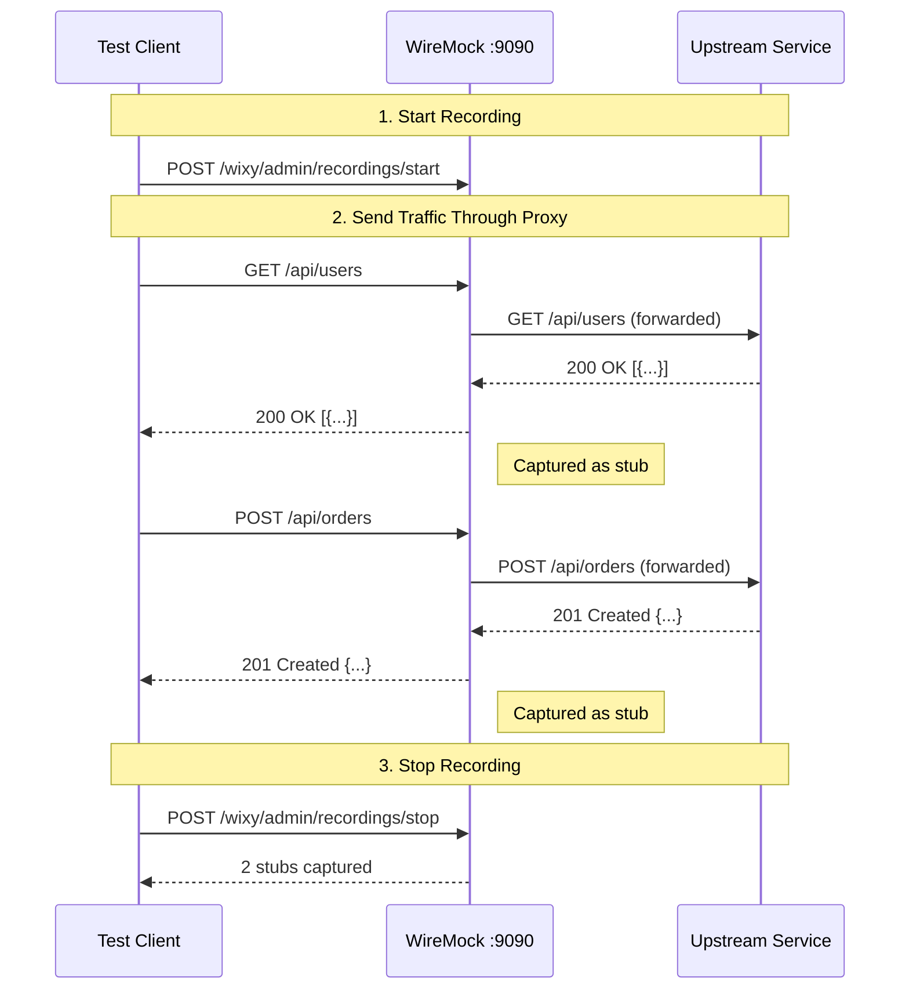

# Record & Playback

WIXY can record real HTTP traffic flowing through the proxy and automatically generate stub mappings. These stubs can then be replayed in isolation, enabling **contract testing** and **offline development**.

## How Recording Works



## Starting a Recording

### Via REST API

```bash
# Start recording to a target URL
curl -X POST http://localhost:8080/wixy/admin/recordings/start \
  -H "Content-Type: application/json" \
  -d '{"targetUrl": "https://api.example.com"}'
```

If no `targetUrl` is provided, WIXY falls back to the configured `wixy.proxy.target-url`:

```bash
# Uses configured target URL
curl -X POST http://localhost:8080/wixy/admin/recordings/start
```

### Via Configuration (Auto-Start)

Set both proxy and recording in configuration to start recording on application startup:

```yaml title="application.yml"
wixy:
  proxy:
    enabled: true
    target-url: "https://api.example.com"
    record: true
```

## Stopping a Recording

```bash
curl -X POST http://localhost:8080/wixy/admin/recordings/stop
```

**Response:**

```json
{
  "status": "Recording stopped",
  "capturedStubs": 5
}
```

## Checking Recording Status

```bash
curl http://localhost:8080/wixy/admin/recordings/status
```

**Response:**

```json
{
  "status": "Recording"
}
```

Possible states: `Recording`, `NeverStarted`, `Stopped`.

## Recording Options

When recording starts, WIXY configures WireMock with these defaults:

| Option | Value | Description |
|--------|-------|-------------|
| `ignoreRepeatRequests` | `true` | Only captures the first request for each unique pattern |
| `makeStubsPersistent` | `true` | Captured stubs survive server restarts |

## Typical Workflow

### 1. Record Against a Real Service

```bash
# Start WIXY
./scripts/start-local.sh

# Start recording
curl -X POST http://localhost:8080/wixy/admin/recordings/start \
  -d '{"targetUrl": "https://jsonplaceholder.typicode.com"}'

# Send traffic through WIXY
curl http://localhost:9090/posts/1
curl http://localhost:9090/users/1
curl http://localhost:9090/todos/1

# Stop recording
curl -X POST http://localhost:8080/wixy/admin/recordings/stop
```

### 2. Replay in Isolation

After stopping the recording, the captured stubs are active. No upstream connectivity is needed:

```bash
# These now return recorded responses — no upstream call
curl http://localhost:9090/posts/1
curl http://localhost:9090/users/1
curl http://localhost:9090/todos/1
```

### 3. Export Stubs for Version Control

The captured stubs can be listed and saved to your project's `wiremock/mappings/` directory:

```bash
curl http://localhost:8080/wixy/admin/mappings > recorded-stubs.json
```

## Error Handling

| Scenario | Response |
|----------|----------|
| Start recording without target URL and none configured | `500` — "Cannot start recording: no target URL configured" |
| Stop recording when not started | Returns normally with 0 captured stubs |

:::tip
Record & Playback is perfect for capturing a real service's contract once, then using the recordings in CI/CD pipelines where the real service may not be available.
:::
