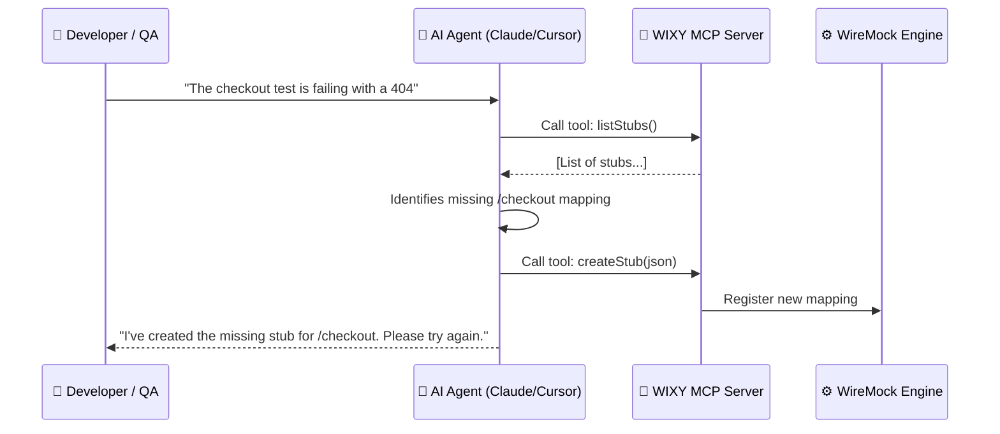

# MCP Overview

WIXY is an **AI-native test proxy**. By implementing the **Model Context Protocol (MCP)**, WIXY allows Large Language Models (LLMs) like Claude, GPT-4, and specialized agents like Cursor to interact directly with your testing environment.

## What is MCP?

The Model Context Protocol is an open standard that enables AI models to safely and securely use external tools and data sources. Instead of you manually copying JSON stubs or logs into a chat window, WIXY "tells" the AI what it can do, and the AI invokes those actions on your behalf.

## How WIXY Uses MCP

WIXY embeds an MCP server directly within its JVM process using **Spring AI**. This server exposes the core functionality of the management plane as **Tools**.

## Key Benefits

| Benefit | Description |
| :--- | :--- |
| **Natural Language Control** | Manage complex proxy configurations using simple English commands. |
| **Generative Mocking** | Describe the response you need, and let the AI handle the WireMock JSON schema. |
| **Instant Debugging** | Ask the AI to audit your stubs and logs to find why a request didn't match. |
| **Automated Workflows** | Enable agents to record, sanitize, and save traffic as part of a CI/CD chain. |

---

## Technical Details

- **Protocol Version:** 1.0.0
- **Transport:** SSE (Server-Sent Events) over HTTP
- **Implementation:** Java 21 + Spring AI MCP
- **Endpoint:** `http://localhost:8080/wixy/mcp`
